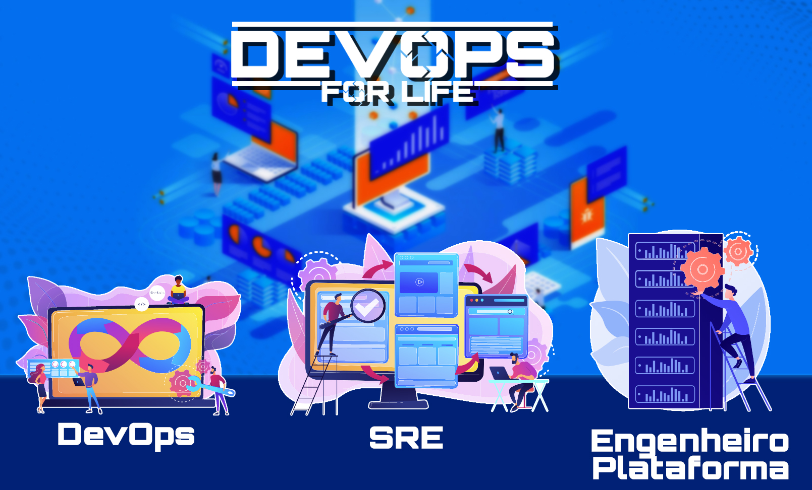
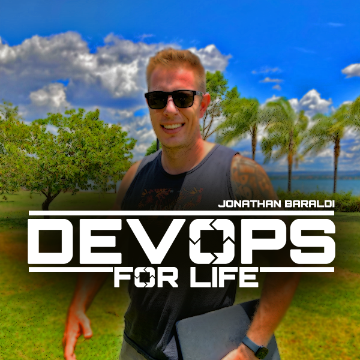

# Super módulo - DevOps, SRE e Engenheria de Plataforma

# DevOps For Life

Este repositório pertence a comunidade DevOps for Life.

http://devopsforlife.io

Acesse e aproveite o cupom de desconto para usuários do GitHub!

## Capítulo 1: Introdução ao DevOps, SRE e Engenharia de Plataforma

1. Introdução ao DevOps: Princípios e Práticas
    Descrição: Conceitos fundamentais do DevOps, incluindo automação, colaboração e feedback contínuo.
2. Introdução ao Site Reliability Engineering (SRE)
    Descrição: Os princípios e práticas do SRE, e como isso se relaciona com o DevOps.
3. Introdução à Engenharia de Plataforma
    Descrição: Uma visão geral da Engenharia de Plataforma e como ela apoia o desenvolvimento e operação de software.

## Capítulo 2: Controle de Versão e Colaboração

4. Git e GitHub: Fundamentos e Melhores Práticas
    Descrição: Fundamentos do Git e GitHub, incluindo criação e gerenciamento de repositórios e colaboração.
5. Estratégias e Fluxos de Trabalho de Branching do Git
    Descrição: Diferentes estratégias de branching do Git e como aplicá-las em projetos.
6. Colaborando com Git: Pull Requests e Revisão de Código
    Descrição: Como colaborar com colegas de equipe usando pull requests e revisão de código.

## Capítulo 3: Infraestrutura como Código (IaC) e Gerenciamento de Configuração

7. Introdução à Infraestrutura como Código (IaC)
    Descrição: Conceitos básicos da IaC e como ela facilita o gerenciamento de infraestrutura.
8. Terraform: Provisionamento e Gerenciamento de Infraestrutura
    Descrição: Uso do Terraform para provisionar e gerenciar infraestrutura de nuvem.
9. Gerenciamento de Configuração com Ansible
    Descrição: Como usar o Ansible para gerenciar a configuração de servidores e aplicativos.

## Capítulo 4: Integração Contínua e Implantação Contínua (CI/CD)

10. Conceitos e Melhores Práticas de CI/CD
    Descrição: Fundamentos da CI/CD, incluindo automação de testes e implantação.
11. Configurando um Pipeline CI/CD com Jenkins
    Descrição: Como criar e gerenciar pipelines de CI/CD usando Jenkins.
12. GitLab CI/CD: Configuração e Fluxo de Trabalho
    Descrição: Configuração e uso do GitLab CI/CD para automação de CI/CD.

## Capítulo 5: Containers e Orquestração

13. Introdução ao Docker: Conceitos Básicos de Containerização
    Descrição: Fundamentos do Docker, incluindo criação e gerenciamento de containers.
14. Docker Compose: Aplicações Multi-Container
    Descrição: Como usar o Docker Compose para gerenciar aplicações multi-container.
15. Kubernetes: Introdução e Arquitetura
    Descrição: Conceitos básicos do Kubernetes e sua arquitetura subjacente.
16. Kubernetes: Implantação e Gerenciamento de Aplicações
    Descrição: Como implantar e gerenciar aplicativos no Kubernetes, incluindo configuração e ajuste de recursos.

## Capítulo 6: Monitoramento e Registro

17. Fundamentos e Melhores Práticas de Monitoramento
    Descrição: Conceitos básicos de monitoramento e as melhores práticas para garantir a saúde e o desempenho de seus aplicativos.
18. Introdução ao Prometheus: Métricas e Alertas
    Descrição: Como usar o Prometheus para coletar métricas e configurar alertas para monitorar seus aplicativos.
19. Registro com Elasticsearch, Logstash e Kibana (ELK Stack)
    Descrição: Implementação e uso da pilha ELK para coletar, armazenar e analisar logs de aplicativos.
20. Rastreamento Distribuído com Jaeger
    Descrição: Como usar o Jaeger para rastreamento distribuído e melhorar a visibilidade do desempenho dos aplicativos.

## Capítulo 7: Plataformas e Serviços em Nuvem

21. Fundamentos do AWS: EC2, S3 e RDS
    Descrição: Introdução aos principais serviços da AWS, incluindo Elastic Compute Cloud (EC2), Simple Storage Service (S3) e Relational Database Service (RDS).
22. Fundamentos do Google Cloud Platform (GCP)
    Descrição: Visão geral dos principais serviços do Google Cloud Platform e como utilizá-los.
23. Visão Geral do Microsoft Azure
    Descrição: Introdução aos principais serviços do Microsoft Azure e como eles podem ser usados em projetos de DevOps, SRE e Engenharia de Plataforma.

## Capítulo 8: Segurança e Conformidade

24. Melhores Práticas de Segurança para DevOps e SRE
    Descrição: Como garantir a segurança em ambientes DevOps e SRE, incluindo gerenciamento de acesso e proteção de dados.
25. Implementando Segurança com DevSecOps
    Descrição: Integração de práticas de segurança no ciclo de vida do desenvolvimento e operação de aplicativos com DevSecOps.
26. Conformidade e Auditoria em DevOps
    Descrição: Gerenciamento de conformidade e auditorias em ambientes DevOps, incluindo padrões e regulamentações comuns.

## Capítulo 9: Site Reliability Engineering (SRE) Aprofundado

27. Conceitos de SRE: Orçamentos de Erro e SLIs/SLOs/SLAs
    Descrição: Introdução a conceitos importantes de SRE, como orçamentos de erro e Indicadores de Nível de Serviço (SLIs), Objetivos de Nível de Serviço (SLOs) e Acordos de Nível de Serviço (SLAs).
28. Gerenciamento de Incidentes e Pós-Mortem
    Descrição: Abordagem de gerenciamento de incidentes e a importância de realizar análises pós-mortem para melhorar continuamente.
29. Planejamento de Capacidade e Testes de Carga
    Descrição: Como realizar planejamento de capacidade e testes de carga para garantir que seus sistemas possam lidar com demanda futura e manter a estabilidade.

## Capítulo 10: DevOps, SRE e Engenharia de Plataforma na Prática

30. Construindo uma Cultura DevOps: Colaboração e Comunicação
    Descrição: A importância da cultura e como promover colaboração e comunicação eficazes entre as equipes de desenvolvimento e operações.

31. Estudos de Caso de DevOps, SRE e Engenharia de Plataforma
    Descrição: Exemplos do mundo real de como empresas adotaram práticas de DevOps, SRE e Engenharia de Plataforma para melhorar a entrega e a confiabilidade do software.

32. Desenvolvimento de Carreira e Certificações em DevOps, SRE e Engenharia de Plataforma
    Descrição: Visão geral das oportunidades de desenvolvimento de carreira e certificações relevantes na área de DevOps, SRE e Engenharia de Plataforma.

